-   [bohemia: The R package of the Bohemia project](#bohemia-the-r-package-of-the-bohemia-project)
    -   [Installation](#installation)
    -   [Setting up data](#setting-up-data)
    -   [Building the package](#building-the-package)
    -   [Package utilities](#package-utilities)
    -   [Functions](#functions)

<!-- README.md is generated from README.Rmd. Please edit that file -->
bohemia: The R package of the Bohemia project
=============================================

This package contains utilities used by the Bohemia research team. It is publicly available for the purposes of reproducibility and transparency.

Installation
------------

To install this package, run the below from within the R console.

``` r
if(!require(devtools)) install.packages("devtools")
install_github('databrew/bohemia')
```

Setting up data
---------------

The package includes both tools (functions) as well as data. In order to set up the package's datasets, the following steps should be taken:

#### Download OSM data

1.  Download Mozambique data from <https://download.geofabrik.de/africa/mozambique-latest-free.shp.zip> into `data-raw/geofabrik` and extract

2.  Download Tanzania data from <https://download.geofabrik.de/africa/tanzania-latest-free.shp.zip> into `data-raw/geofabrik` and extract

#### Run the data compilation script

1.  From the command line, run `cd data-raw; Rscript DATASET.R; cd..`

Building the package
--------------------

Having done the above, run `Rscript build_package.R` from within the main directory to compile the package.

Package utilities
-----------------

This package contains several noteworthy tools. What follows is a walk-through of some of them.

### Data

#### Country-level polygonal data

``` r
library(sp)
library(bohemia)

# Create a map of Mozambique at the second administrative level (district)
plot(bohemia::mozambique2)
```

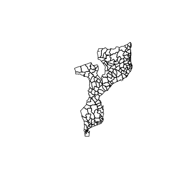

``` r

# Create a map of Mozambique at the tertiary administrative level (posto administrativo)
plot(bohemia::mozambique3, lwd = 0.2)
```


``` r

# Create a map of Tanzania at the second administrative level (district)
plot(bohemia::tanzania2)
```

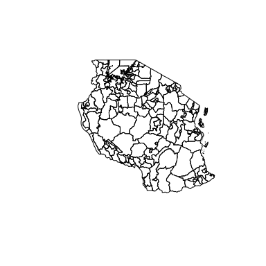

``` r

# Create a map of Tanzania at the tertiary administrative level (posto administrativo)
plot(bohemia::tanzania3, lwd = 0.2)
```

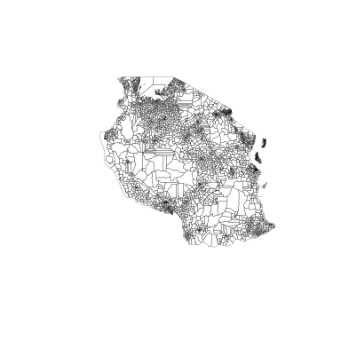

#### Study area polygonal data

``` r
plot(bohemia::mopeia2)
```


``` r
plot(bohemia::mopeia3)
```

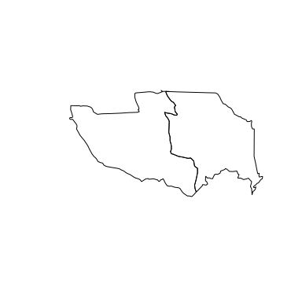

``` r

plot(bohemia::rufiji2)
```

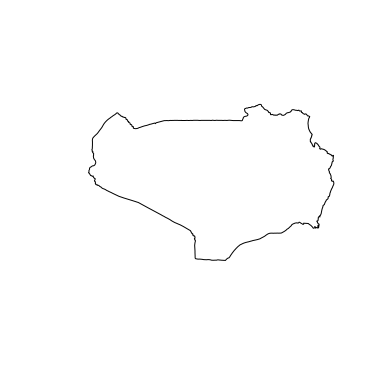

``` r
plot(bohemia::rufiji3)
```


#### Study area road data

``` r
plot(bohemia::mopeia2)
plot(bohemia::mopeia_roads, add = TRUE)
```

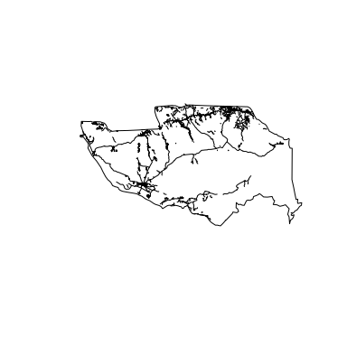

``` r

plot(bohemia::rufiji2)
plot(bohemia::rufiji_roads, add = TRUE)
```

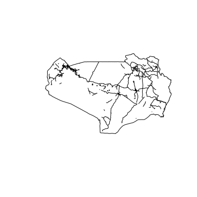

#### Study area road data

``` r
plot(bohemia::mopeia2)
plot(bohemia::mopeia_roads, add = TRUE)
```


``` r

plot(bohemia::rufiji2)
plot(bohemia::rufiji_roads, add = TRUE)
```


#### Study area water data

``` r
plot(bohemia::mopeia2)
plot(bohemia::mopeia_water, add = TRUE)
plot(bohemia::mopeia_waterways, add = TRUE)
```


``` r

plot(bohemia::rufiji2)
plot(bohemia::rufiji_water, add = TRUE)
plot(bohemia::rufiji_waterways, add = TRUE)
```

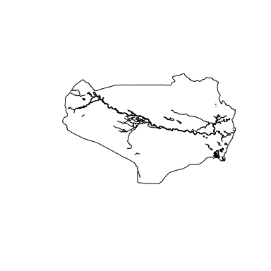

Functions
---------

### Generating fake data

Some methods and analysis require "dummy" data in order to be tested. Functions which generate dummy data begin with the prefix `generate_fake`. For example, `generate_fake_locations` creates a dataframe of `n` locations, grouped into `n_clusters` clusters, which is useful for testing algorithms related to clustering, buferring, etc.

Here is a working example:

``` r
set.seed(1)
library(tidyverse)
#> ── Attaching packages ────────────────────────────────── tidyverse 1.2.1 ──
#> ✔ tibble  2.1.3     ✔ purrr   0.3.2
#> ✔ readr   1.3.1     ✔ stringr 1.4.0
#> ✔ tibble  2.1.3     ✔ forcats 0.4.0
#> ── Conflicts ───────────────────────────────────── tidyverse_conflicts() ──
#> ✖ dplyr::filter()  masks stats::filter()
#> ✖ purrr::is_null() masks testthat::is_null()
#> ✖ dplyr::lag()     masks stats::lag()
#> ✖ dplyr::matches() masks testthat::matches()
library(sp)
library(bohemia)
# Generate some fake data
fake <- generate_fake_locations(n = 1000,
                                n_clusters = 10,
                                sd = 0.04)
# Plot the fake data
plot(fake$x, fake$y, col = rainbow(10)[fake$cluster])
```

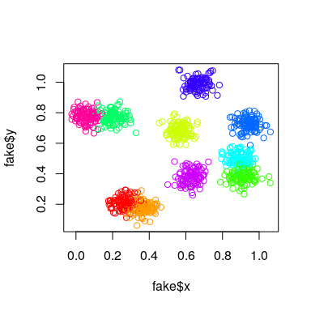

### Generating village boundaries

``` r
# Generate boundaries from the point locations
boundaries <- bohemia::create_borders(df = fake)
# Plot the boundaries
cols10 <- rainbow(10)
cols <- cols10[fake$cluster]
plot(fake$x, fake$y, col = cols, pch = 16, cex = 0.5)
plot(boundaries, add = T, col = adjustcolor(cols10, alpha.f = 0.3),
     border = NA)
```

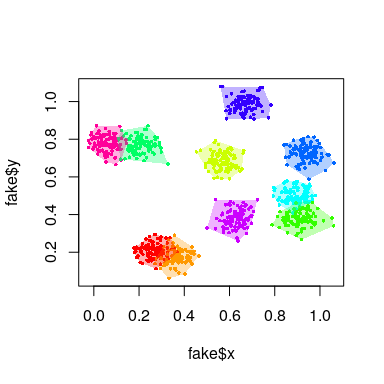

### Generating external buffers

``` r
# Generate buffers from boundaries
buffers <- bohemia::create_buffers(shp = boundaries,
                                   meters = 5000)
plot(fake$x, fake$y, col = cols, pch = 16, cex = 0.5)
plot(boundaries, add = T, col = adjustcolor(cols, alpha.f = 0.3))
plot(buffers, add = T)
```


### Generating buffers based on tesselation

As an alternative to the above approach, and so as to generate generealizable boundaries with no "holes", we can use voronoi tesselation as opposed to convex hulling.

``` r
boundaries <- create_borders(df = fake, voronoi = TRUE)
#> Loading required namespace: deldir
# Plot the boundaries
plot(fake$x, fake$y, col = cols, pch = 16, cex = 0.5)
plot(boundaries, add = T, col = adjustcolor(cols, alpha.f = 0.3))
```

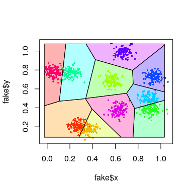

### Generating tesselated buffers

Just like with convex hull generated borders, we can add buffers to delauney triangles.

``` r
# Generate buffers from boundaries
buffers <- bohemia::create_buffers(shp = boundaries,
                                   meters = 5000)
plot(fake$x, fake$y, col = cols, pch = 16, cex = 0.5)
plot(boundaries, add = T, col = adjustcolor(cols, alpha.f = 0.3), border = NA)
plot(buffers, add = T, col = adjustcolor(cols10, alpha.f = 0.3))
```

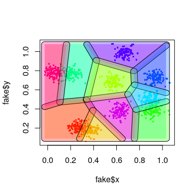

### Generating tesselated internal buffers

In the above, we use *external* boundaries, which results in one areas borders bleeding into the core of another area. As an alternative to this, we can use *internal* boundaries.

``` r
# Generate buffers from boundaries
buffers <- bohemia::create_buffers(shp = boundaries,
                                   meters = -5000)
plot(fake$x, fake$y, col = 'white', pch = 16, cex = 0.5)
# plot(boundaries, add = T, col = adjustcolor(cols, alpha.f = 0.3))
plot(buffers, add = T, col = adjustcolor(cols10, alpha.f = 0.4))
points(fake$x, fake$y, col = cols, pch = 16, cex = 0.5)
```

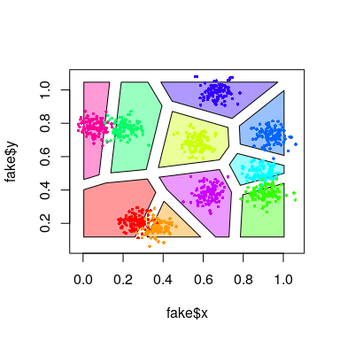

### Generating "collapsed" tesselated internal buffers

For the purposes of an intervention in which each area is assigned status A or B (ie, intervention or control), the need for buffers between areas of identical intervention status is redundant (and can unecessarily eliminate potential study participants).

``` r
# Define some ids 
ids <- sample(1:2, nrow(boundaries), replace = TRUE)
cols2 <- c('lightblue', 'orange')
cols <- cols2[ids]

# Create a dataframe for joining clusters to ids
merger <- data.frame(cluster = boundaries@data$cluster,
                     id = ids)
# Bring the ids into the point data
fake <- left_join(fake, merger, by = 'cluster')

# Generate buffers from boundaries
buffers <- create_buffers(shp = boundaries,
                                   meters = -5000,
                                   ids = ids)
plot(fake$x, fake$y, col = 'white', pch = 16, cex = 0.5)
# plot(boundaries, add = T, col = adjustcolor(cols, alpha.f = 0.8))
plot(buffers, add = T, col = adjustcolor(cols2[buffers@data$id], alpha.f = 0.5))
points(fake$x, fake$y, col = cols2[fake$id], pch = 16, cex = 0.5)
```


### Generating village-agnostic clusters

Clusters can be defined *a priori* (ie, named administrative units) or programatically (ie, village-agnostic groups of `n` people). Alternatively, a cluster could be formed programatically, but with certain restrictions (such as the a rule prohibiting the division of a village into two). To do this, use the `create_clusters` function.

``` r
fake <- generate_fake_locations(n = 1000,
                                n_clusters = 10,
                                sd = 0.1) %>% dplyr::select(-cluster)
plot(fake$x, fake$y, pch = 16)
```


``` r
cs <- create_clusters(cluster_size = 100,
                      locations = fake)

rcols <- length(unique(cs$cluster))
plot(cs$x, cs$y, col = rainbow(rcols)[cs$cluster])
```

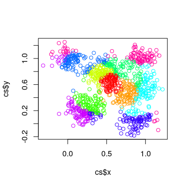

The data generated from `create_clusters` is compatible with the other functions herein described. Here are some usage examples:

``` r
set.seed(2)
fake <- generate_fake_locations(n = 1000,
                                n_clusters = 5,
                                sd = 0.1) %>% dplyr::select(-cluster)
cs <- create_clusters(cluster_size = 100,
                      locations = fake)
rcols <- length(unique(cs$cluster))

# Create true borders
plot(cs$x, cs$y, col = rainbow(rcols)[cs$cluster])
boundaries <- create_borders(df = cs)
plot(boundaries, add = T)
```

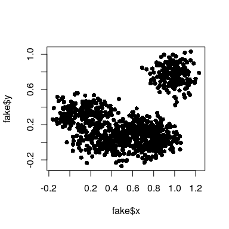

``` r

# Create tesselation borders
plot(cs$x, cs$y, col = rainbow(rcols)[cs$cluster])
boundaries <- create_borders(df = cs, voronoi = TRUE)
plot(boundaries, add = TRUE)
```


``` r

# Create internal buffered tesselation borders
plot(cs$x, cs$y, col = rainbow(rcols)[cs$cluster])
boundaries <- create_borders(df = cs, voronoi = TRUE)
buffered <- create_buffers(shp = boundaries, meters = -3000)
plot(buffered, add = TRUE)
```


``` r

# Create internal buffered tesselation borders with binary treatment status
id_df <- cs %>% 
  group_by(cluster) %>%
  tally 
id_df$id <- sample(1:2, nrow(id_df), replace = TRUE)
cs <- left_join(cs, id_df)
#> Joining, by = "cluster"
cols2 <- c('darkblue', 'pink')
plot(cs$x, cs$y, col = cols2[cs$id])
boundaries <- create_borders(df = cs, voronoi = TRUE)
buffered <- create_buffers(shp = boundaries, meters = -3000,
                           ids = id_df$id)
plot(buffered, add = TRUE)
```


What follows below is a visualization of how the `create_buffers` algorithm works.

``` r
set.seed(2)
fake <- generate_fake_locations(n = 1000,
                                n_clusters = 5,
                                sd = 0.1) %>% dplyr::select(-cluster)
cs <- create_clusters(cluster_size = 100,
                      locations = fake,
                      plot_map = TRUE,
                      save = 'animation')
setwd('animation')
system('convert -delay 100 -loop 0 *.png result.gif')
setwd('..')
```


