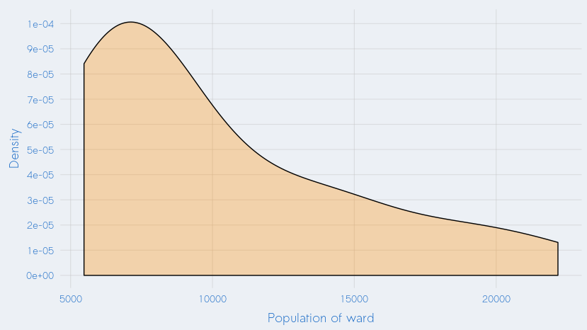

Coefficient of variation
================

The objective
-------------

We want a general notion of the the coefficient of variation (CV) in the incidence of malaria in the districts of Rufiji (Tanzania) and Mopeia (Mozambique).

The challenges
--------------

Estimating this with the currently available data is not straightforward. In addition to the obvious shortcomings in using data from several years ago (things may have changed since then), there is a larger limitation: the data we have from Mopeia is at the person-level, whereas the Rufiji data is aggregated at the level of the ward (the Tanzanian equivalent of the posto administrativo).

One could simply take the CV in the Mopeia clusters and compare it with the CV in the Rufiji wards, but this comparison would be inappropriate since the sizes of these areas are so radically different. Whereas Mopeia clusters are made up of several hundred people, Rufiji wards include thousand (and in some cases, tens of thousands).

A larger unit size inevitably leads to a smaller CV.



The work-around
---------------

Given the incompatabilities in the data being compared, we need to get creative. We previously estimated that CV for Mopeia, based on person-level data. We want to use similar methods on our two datasets, but their format (person-level vs. ward-level) is too dissimilar. Since we can't transform ward-level data into person-level data, we'll instead do the opposite: transorm our person-level data (from Mopeia) to pseudo-ward-level data (ie, much larger numbers than clusters), using resampling.

The result will be a *true* coefficient of variation based on observed Rufiji ward-level data and an *estimated* coefficient of variation based on Mopeia pseudo-ward-level data (via resampling). To the extent that the two are similar, we can feel comfortable using the same CV for Rufiji as the one we estimated based on person-level data from Mopeia. To the extent that they are very different, we may need to consider getting more granular data from Rufiji before moving forward.

Methods
-------

``` r
# Loop throgh each ward to get population size, resample from mopeia, calculate cv
acd$id <- 1:nrow(acd)
out <- rep(NA, nrow(ruf))
for(i in 1:nrow(ruf)){
  this_ward_size <- round(ruf$population[i])
  sampled <- acd[sample(acd$id, this_ward_size, replace = TRUE),]
  sampled_incidence <- length(which(sampled$HAD_MALARIA == 1)) / nrow(sampled)
  out[i] <- sampled_incidence
}

cv_rufiji <- sd(ruf$incidence) / mean(ruf$incidence)
cv_mopeia <- sd(out) / mean(out)
```

Results
-------

The ward-level coefficient of variation of the incidence of Malaria in Rufiji is: 0.67.

The pseudo-ward-level coefficient of variation in the incidence of Malaria in Mopeia is: 0.01.

Interpretation
--------------

The results are not reliable. The number of observations in the Mopeia ACD dataset (approximately 1500) is far too small to be compared with the level of aggregation in the Rufiji incidence dataset (many thousand per ward). In order to "upscale" the Mopeia dataset, we (inevitably) have to resample from the small (1500) ACD numbers multiple times. Resampling from the same set many times artificially deflates variation, hence the radically different CV estimates between the two datasets.

Comparability
-------------

Beyond the possible comparability of the two locations (which this exercise has failed to address), it is worth noting that in the Rufiji ward-level incidence data, variance is *extremely high*. The coefficient of variation in the ward-level data is 0.6670971, significantly higher than the CV we (Aina) previously estimated for Mopeia. Given this high ward-level CV, if we were to obtain more granular data (ie, geographical units at the same size of the Mopeia clusters) we should anticipate an *even higher* CV. The take-away: variation is much higher in Rufiji than in Mopeia.

Action
------

All of the prior information should be taken with a grain of salt. The data we have for Rufiji and Mopeia are *qualitatively* different (passive vs. active case-finding, all ages vs. children, aggregated vs. granular) and therefore cannot be *quantitatively* compared reliably.

We should obtain granular (person-level) incidence data from Malaria, if it exists.

Technical details
-----------------

This document was produced on 2019-06-28 on a Linux machine (release 4.15.0-52-generic. To reproduce, one should take the following steps:

-   Clone the repository at <https://github.com/databrew/bohemia>

-   Populate the `analyses/cv/data` directory with the following files:

<!-- -->

    ├── Malaria incidence rates- age groups.xlsx
    └── Malaria incidence rates -geographical variations from HDIS2 data.xlsx

-   Populate the `analyses/cv/data/from_eldo` directory with the following files (emailed from Eldo to team on June 10 2019):

<!-- -->

    ├── Census_2016.csv
    ├── COST_ACD_Core_13-05-2019.csv
    ├── COST_ACD_Follow_Up_Core_13-05-2019.csv
    ├── COST_ACD_Follow_Up_V062017_Core_10-05-2019.csv
    ├── COST_Censo2017_Core.1.4.2019.csv
    ├── COST_CROSS_2017_Core_Final_11.04.2019.csv
    ├── COST_CROSS_2018_Core_Final_11.10.2018.csv
    ├── COST_Cross_2019_Core_10-06-2019.csv
    ├── COST_PCD_2019_Core_15-04-2019.csv
    ├── COST_PCD_V062017_Core_17-01-2019.csv
    ├── COST_SprayStatus_by_Village_Id_11.04.2019.EE.csv
    └── Pcd1_core.csv

-   Download the `COST_Permids.New&Old_EE.csv` file, sent by Eldo to team on June 11 2019, into `data/from_eldo`.

-   "Render" (using `rmarkdown`) the code in `analysis/cv/README.Rmd`

Any questions or problems should be addressed to <joe@databrew.cc>
