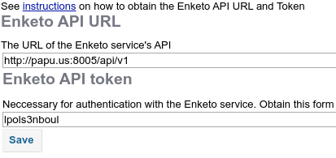

# Setting up enketo

- (Much of the following is based on [this guide](https://blog.enketo.org/install-enketo-production-ubuntu/), but with some modifications for our server and use-case)
- Important configuration details at https://enketo.github.io/enketo-express/tutorial-10-configure.html


## Launch an instance

-Follow the steps in the [ODK set up guide](guide_odk_setup.md). Small, 15 gb, open security.
-For this example, we'll use the domain papu.us.

## Set up with domain

- Via domains.google.com

## Set up the enketo user

-SSH into the machine:

```
ssh -i "/home/joebrew/.ssh/odkkey.pem" ubuntu@papu.us
```

```
sudo adduser enketo --disabled-password;
sudo mkdir /home/enketo/.ssh;
sudo chown enketo:enketo /home/enketo/.ssh;
sudo cp ~/.ssh/authorized_keys /home/enketo/.ssh;
sudo chown enketo:enketo /home/enketo/.ssh/authorized_keys;
sudo chmod 600 /home/enketo/.ssh/authorized_keys;
sudo usermod -a -G sudo enketo;
```

Now type `sudo visudo` and add this line to the end of the file:
```
enketo     ALL=(ALL) NOPASSWD:ALL
```


# NOT DOING
~~~
Run the following:
```
sudo nano /etc/ssh/sshd_config
```
And make sure the following values are set:
```
PermitRootLogin no
ChallengeResponseAuthentication no
PasswordAuthentication no
UsePAM no
```

Restart ssh
```
sudo service ssh restart
exit
```
~~~


## Set up shortcut

On local machine, add the following to ~/.bashrc:
```
alias enketo='ssh -i "/home/joebrew/.ssh/odkkey.pem" enketo@papu.us'
```

Then run the below:
```
source ~/.bashrc
```

Log out, then log in again by simply typing `enketo`

## Installing required software

- Log in as the enketo user (see above) and run the following LINE BY LINE:
```
sudo apt-get update;
sudo apt-get upgrade -y;
sudo apt-get autoremove -y;
sudo apt-get install -y git nginx htop build-essential redis-server checkinstall python;
sudo apt-get install -y gconf-service libasound2 libatk1.0-0 libatk-bridge2.0-0 libc6 libcairo2 libcups2 libdbus-1-3 libexpat1 libfontconfig1 libgcc1 libgconf-2-4 libgdk-pixbuf2.0-0 libglib2.0-0 libgtk-3-0 libnspr4 libpango-1.0-0 libpangocairo-1.0-0 libstdc++6 libx11-6 libx11-xcb1 libxcb1 libxcomposite1 libxcursor1 libxdamage1 libxext6 libxfixes3 libxi6 libxrandr2 libxrender1 libxss1 libxtst6 ca-certificates fonts-liberation libappindicator1 libnss3 lsb-release xdg-utils wget
```
- Install NodeJS and global Node packages
```
curl -sL https://deb.nodesource.com/setup_12.x | sudo -E bash -
sudo apt-get install -y nodejs
sudo npm install -g pm2 npm
```

-Let Ubuntu automatically install security updates (keep default values and select Yes when asked):
```
sudo dpkg-reconfigure -plow unattended-upgrades
```

## Installing Enketo Express and  dependencies

- Run the following, line by line:
```
cd ~
sudo git clone https://github.com/enketo/enketo-express.git
cd enketo-express
sudo chown -R 1001:1001 "/home/enketo/.npm"
npm config set unsafe-perm=true
sudo chown -R $USER:$(id -gn $USER) /home/enketo/.config
sudo mkdir /home/enketo/enketo-express/node_modules
npm rebuild node-sass
sudo npm install --production
```
- (The above takes a while)


### Database configuration

Set up redis

```
sudo systemctl stop redis;
sudo systemctl disable redis;
sudo systemctl daemon-reload;
sudo mv /etc/redis/redis.conf /etc/redis/redis-origin.conf;
sudo cp ~/enketo-express/setup/redis/conf/redis-enketo-main.conf /etc/redis/;
sudo cp ~/enketo-express/setup/redis/conf/redis-enketo-cache.conf /etc/redis/;
sudo systemctl enable redis-server@enketo-main.service;
sudo systemctl enable redis-server@enketo-cache.service;
sudo systemctl start redis-server@enketo-main.service;
sudo systemctl start redis-server@enketo-cache.service;
```

Test: Cache database

```
redis-cli -p 6380
ping
exit
```

Test: Main database
```
redis-cli -p 6379
ping
exit
```
The response to both tests should be: “PONG”.

## Set up logo

- Send a file from local to the remote server:
```
# remote
sudo mkdir /home/enketo/Documents
cd /home/enketo
sudo chmod 777 Documents
#local
scp -i ~/.ssh/odkkey.pem ~/Documents/bohemia/misc/img/logo.png enketo@18.190.57.240:/home/enketo/Documents/logo.png
scp -i ~/.ssh/odkkey.pem /home/joebrew/Documents/bohemia/misc/enketo-config.json enketo@18.190.57.240:/home/enketo/Documents/enketo-config.json
scp -i ~/.ssh/odkkey.pem /home/joebrew/Documents/bohemia/misc/enketo-config.json enketo@18.190.57.240:/home/enketo/Documents/enketo-config.json
# remote
sudo cp /home/enketo/Documents/enketo-config.json /home/enketo/enketo-express/config/config.json
sudo cp /home/enketo/Documents/enketo-config.json /home/enketo/enketo-express/config/default-config.json # this is strange, but apparently matters - need to overwrite the default
sudo cp /home/enketo/Documents/logo.png /home/enketo/enketo-express/public/images/logo.png
```


- Rebuild:
```
cd ~/enketo-express
sudo npm install --production
```

- Start enketo:
```
#pm2 kill
#sudo kill -9 $(sudo lsof -t -i:8005) # to kill anything already on that port
npm start
```
- Check that it's running at papu.us:8005
- Configure pm2 to make sure that the server automatically starts up upon reboot. Do this in a new terminal:
```
cd ~/enketo-express
pm2 start app.js -n enketo
pm2 save
sudo pm2 startup ubuntu -u enketo
```

## Pointing ODK to the right place

- Go to bohemia.systems and click on Site Admin -> Preferences
- Fill out the credentials as per below  



API URL: http://papu.us:8005/api/v1
API TOKEN: lpols3nboul


Test that it's working (ie, that we get a 201 response for this query) (won't work until configuring ODK agg server):
```
curl --user lpols3nboul: -d "server_url=https://bohemia.systems&form_id=census" http://papu.us:8005/api/v1/survey

```

curl --user lpols3nboul: -d "server_url=https://bohemia.systems/Aggregate.html&form_id=census" http://papu.us:8005/api/v1/survey


# STOP HERE!!!

Setting up https causes problems for ODK Aggregate. Go no further. The rest of this is for paper trail purposes only.


## NGINX

Create a webserver configuration as follows:
```
sudo nano /etc/nginx/sites-available/enketo
```

Paste the below:
```
server {
    listen 80;
    server_name papu.us;
    location / {
        proxy_pass  http://127.0.0.1:8005;
        proxy_redirect off;
        proxy_set_header Host $host;
        proxy_set_header X-Real-IP $remote_addr;
        proxy_set_header X-Forwarded-For $proxy_add_x_forwarded_for ;
        proxy_set_header X-Forwarded-Proto https ;
    }

    client_max_body_size 100M;

    add_header Strict-Transport-Security max-age=63072000;
    add_header X-Frame-Options DENY;
    add_header X-Content-Type-Options nosniff;
}
```

Activate the new configuration:
```
sudo rm /etc/nginx/sites-enabled/default
sudo ln -s /etc/nginx/sites-available/enketo /etc/nginx/sites-enabled/enketo
sudo service nginx restart
```

- Set up https
```
sudo apt-get update
sudo apt-get install software-properties-common
sudo add-apt-repository ppa:certbot/certbot
sudo apt-get update
sudo apt-get install python-certbot-nginx
sudo certbot --nginx # choose to remove http access, redirecting everything to https
sudo service nginx restart
```

- Ban rogue users:
```
sudo apt-get install -y fail2ban
sudo cp /etc/fail2ban/jail.conf /etc/fail2ban/jail.local
sudo service fail2ban restart
```


- Set up firewall:
```
sudo apt-get install ufw
sudo ufw allow ssh
sudo ufw allow 80
sudo ufw allow 443
sudo ufw enable
sudo ufw status
```


## test

curl --user lpols3nboul: "http://papu.us:80/api/v1/surveys/number?server_url=https://bohemia.systems"

???
curl --user lpols3nboul: -d "server_url=https://bohemia.sstems&form_id=recon" http://papu.us:8080/api/v1/survey

curl --user lpols3nboul: -d "server_url=https://bohemia.systems/Aggregate&form_id=census" https://papu.us/api/v1

curl --user lpols3nboul: -d "server_url=https://bohemia.systems/" https://papu.us/api/v1/surveys/number

curl --user lpols3nboul: -d "server_url=https://bohemia.systems&form_id=recon" https://papu.us/api/v1/survey


## Managing forms
- See API documentation here: https://apidocs.enketo.org/v1

- To delete a form, run the following:
```
curl -X DELETE --user lpols3nboul: -d "server_url=https://bohemia.systems/Aggregate&form_id=census" http://papu.us/api/v2/survey
```

## Alternative to enketo

https://kobo.humanitarianresponse.info/
