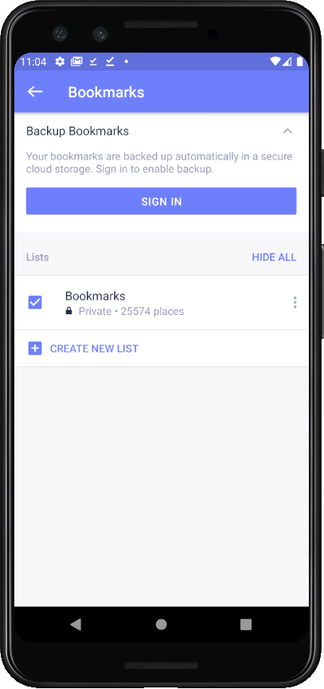
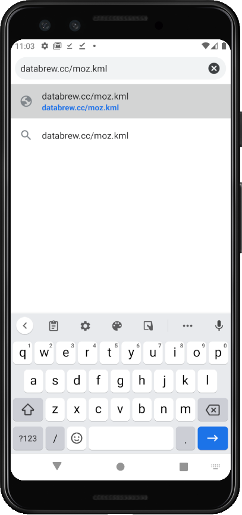
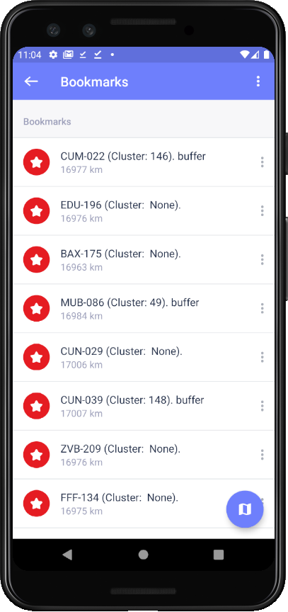

# Navigating to households in the full census

## Context

For the Bohemia "full census", fieldworkers will visit areas which were already visited during the "mini census". In order to navigate to households, offline maps are essential. This document provides instructions for how to navigate to households during the Bohemia full census.

## Setting up a device

*Device installation*

- First, download the MAPS.ME application [HERE](https://play.google.com/store/apps/details?id=com.mapswithme.maps.pro&hl=en&gl=US)  
- Make sure you have version 9.3 or above.

*Saving geographic tiles*

In order to have meaningful background tiles during offline use, you'll need to pre-download about 100-200 mb of data.

- On the device, open MAPS.ME
- Click the three horizontal lines in the bottom right
- Click "Download Maps"
- In the search bar at the top of the page, search for the word "Mozambique"
- Click on the filtered search results for "Mozambique" to download

*Loading household locations*

There are two ways to load household locations:

**Method 1: logging into MAPS.ME**

- On the device, open MAPS.ME
- Click the star icon in the bottom
- At the top of the page, click "SIGN IN"

- Sign in as user "bohemiamalaria@gmail.com" with password "bohemiaproject"  
- You will now have a list in your bookmarks named "Bohemia Agregados MOZ"

**Method 2: retrieving files manually**

- On the device, open a web browser (google chrome) and go to https://databrew.cc/moz.kml. This will initiate the download of a `kml` file.  

- Once the file is downloaded, open it.
- By default, the file should open in MAPS.ME; if it does not, manually override the opening so as to ensure that it opens with MAPS.ME.
- Click the star icon in the bottom
- Click "Bookmarks"

## Using MAPS.ME for navigation  

- On the device, open MAPS.ME
- Click the star icon in the bottom
- Click the list of households (named "Bohemia Agregados MOZ" if method 1; "Bookmarks" if method 2)  
- You will now see a list of households. In the upper right, click the three dots to sort by name or distance

- Click on one household to navigate there; alternatively...
- Click the circular blue map icon in the bottom right. This will load all locations
- Click on a location
