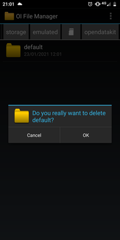

# ODK-X Migration

## Context

The Bohemia census requires "migrating" data from the mini-census to the census for the purpose of "pre-populating" certain fields. Migration is a time-consuming process if done on-device (and can be prohibitively slow, depending on device, internet speed, server processing power, etc.). This guide describes both (a) how to get minicensus data onto an ODK-X server (cloud endpoint) and (b) how to quickly get data from that server onto devices.

## Getting minicensus data onto the server

Follow the code in `scripts/odk_x_migration/migrate_minicensus.R`. Prior to moving forward, delete all data from all devices. To do this, close the ODK-X applications and delete the folder `default`.

## Getting data from server onto seed device

- Open the ODK-X Tables app.  
- Press the settings button (gear icon in upper right)  
- Select "Server Settings"  
- Slick "Server URL"  
- Set the server URL to https://databrew.app  
- Set the server sign-on credential as "Username"  
- Set the Username as "data"  
- Set the server password as "data"  
- Click the back button  
- An "Authenticate credentials" pop-up will show show up; Click "Authenticate New User".  
- Slick "Verify User Permissions"  
- You should see a "Verification successful" window. Click "OK".  
- You'll be brought back to the "General Settings" page. Click the back button until you return to the main menu.
- Click the refresh button (circular arrows in the upper right).  
- Click "Sync now"  

## Prepping non-seed devices

On **all devices**, you'll need to install the ODK-X client suite.

You'll start by downloading and installing 4 applications on the android device.

- **Install OI File Manager**: Go to https://github.com/openintents/filemanager/releases/download/2.2.2/FileManager-release-2.2.2.apk and download the [APK file](https://github.com/openintents/filemanager/releases/download/2.2.2/FileManager-release-2.2.2.apk). Since the app is not being downloaded from the Google Play App Store, your device may bring up a message to the effect of "not allowed to install unknown apps from this source". In this case, you will need to grant permission to your device to "install unknown apps" or "allow installation from source".  

- **Install ODK-X Services**: Go to https://github.com/odk-x/services/releases/tag/2.1.7 and download the [APK file](https://github.com/odk-x/services/releases/download/2.1.7/ODK-X_Services_v2.1.7.apk). Then install.

- **Install ODK-X Survey**: Go to https://github.com/odk-x/survey/releases/tag/2.1.7 and download the [APK file](https://github.com/odk-x/survey/releases/download/2.1.7/ODK-X_Survey_v2.1.7.apk). Then install.

- **Install ODK-X Tables**: Go to https://github.com/odk-x/tables/releases/tag/2.1.7 and download the [APK file](https://github.com/odk-x/tables/releases/download/2.1.7/ODK-X_Tables_v2.1.7.apk). Then install.

- **Barcode scanner**: Go to https://play.google.com/store/apps/details?id=com.google.zxing.client.android&hl=en&gl=US and install the app.

If in doubt, follow the [guide to set up the client](guide_odkx_client.md)

## Getting data from the seed to the other devices

- Copy the folder from the device to a computer hard drive. In the case of DataBrew managing the seed device, you will be sent the folder
- Remember, delete any previous ODK-X data on device prior to the next step  
- Copy the folder from the computer to each device via USB cable
- You'll now be able to sync in a matter of minutes
