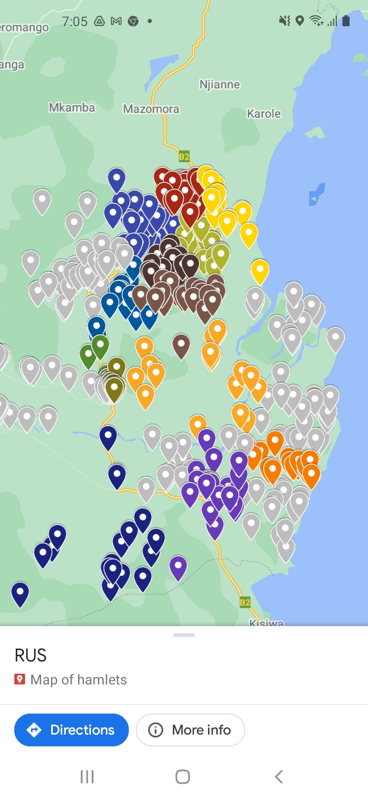

# Basic tools for offline navigation

## Context

Some components of the Bohemia project require a simple method for navigating to pre-defined locations. Though the census database is usable for this, it is overkill in the sense that (a) it requires syncronization with a very large amount of data, (b) the location of every single household is not necessary, and (c) some of the locations which require navigation are _not_ part of the census explicitly (such as bodies of water of animal enclosures).

Accordingly, for these purposes, we recommend using the `MAPS.ME` application with the below flow.

## MAPS.ME

### Installation

- Download the application [HERE](https://play.google.com/store/apps/details?id=com.mapswithme.maps.pro&hl=en&gl=US)

### Creating a map

- Follow the instructions in the "Google Maps" section (below)
- Once a map is created (like [this one](https://www.google.com/maps/d/u/0/edit?mid=1JCoPmqi2lb-2ypgEMmvBs3UzfQKjJ4Uk)), clikc the 3 dots in the upper right and download as KML. In this case we download to `bohemia/scripts/locations.kml`
- Navigate to https://github.com/databrew/bohemia/blob/master/misc/locations.kml in the web browser of the mobile device.
- Click and hold on the text "View raw"
- Click "download link"
- Once downloaded, click the text at the bottom and open the file in "MAPS.ME"

#### Pre-loading an area for offline use

- Open the MAPS.ME application
- Click the star icon on the bottom of the screen  
- You'll see a list in which there is an item named "Location hierarchy" (or similar). Keep that one checked. Click the text.
- Now you'll see a list of all locations. They are pre-loaded onto the device.
- Click on a few locations (following instructions in below section) so as to get prompted to download certain offline areas (do this with internet connection, of course)

#### Use in the field

- Follow the instructions in the previous section to get to the list of locations
- Click on the name of a particular location to navigate to it
- Alternatively, click the map icon in the bottom right to see all on a map
- From map view, click on any location, and then click "route to" to navigate there

## Google Maps

`DEPRECATED. DO NOT USE GOOGLE MAPS`

### Instructions

#### Creating a map

- Create a map in https://www.google.com/maps/d/u/0/
- Click the "share" button
- Create a public URL. For this example: https://www.google.com/maps/d/u/0/edit?mid=1JCoPmqi2lb-2ypgEMmvBs3UzfQKjJ4Uk&usp=sharing

#### Pre-loading an area for offline use

- Open Google Maps on android
- Make sure you have an internet connection and are logged in
- Type "Mopeia" into the search bar
- At the bottom, tap the name "Mopeia"
- Click "Download"
- Zoom out to the whole study area

#### Use in the field

- Navigate to [THIS PAGE](https://github.com/databrew/bohemia/blob/master/guides/guide_google_maps.md) on the phone web browser.
- Click the link to the public URL of the map: https://www.google.com/maps/d/u/0/edit?mid=1JCoPmqi2lb-2ypgEMmvBs3UzfQKjJ4Uk&usp=sharing

- Make sure to save the link on the device for offline access (as a favorite, homescreen menu item, etc.)
- You can now navigate from place to place, see all locations, click on a location for information, etc.

