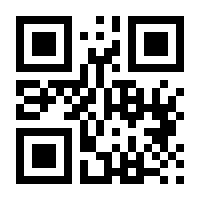

# Location handling

This document gives an overview of the Bohemia project's approach to handling location data.

## The location ID

- For the purposes of this project/document, we understand the terms "location" and "household" to be synonymous
- Every location has associated administrative data (country, region, district, ward, village, neighborhood, etc.).
- Associated administrative data is _not_ stored in the ID, but is instead stored in a "key" table, which takes on an appearance similar to the below:

| id|country |region |
|--:|:-------|:------|
|  1|MOZ     |Mopeia |
|  2|TZA     |Rufiji |
|  3|TZA     |Rufiji |

- The only data explictly stored in the location ID is (a) the 3-digit ID of the fieldworker who first censed the house and (b) the 4-digit ID of the house. So, the total location ID is seven digits.
- Each fieldworker is assigned a fieldworker ID (000 to 999) prior to work. This ID never changes
- Each fieldworker is assigned a list of 10,000 household IDs prior to work (000 to 9999). They will not use all of these IDs.
- As census work is carried out, the fieldworker uses up, sequentially, the numbers assigned to them.
- The fieldworker data will be stored in a table with the below format:

|name |id  |
|:----|:---|
|Joe  |561 |
|Ben  |562 |

The fieldworker-specific household ids will be stored in a table with the below format:

|fieldworker_id |household_id |
|:--------------|:------------|
|561            |000         |
|561            |001         |
|561            |002         |
|561            |003         |

- So, when fieldworker "Joe" (id 561) begins censing housheholds, the first house he does is number 561000. The next house he does is number 561001. Etc.
- Zeroes are never removed.
- If a mistake is made, a number can be skipped/deleted.

## Why _a priori_ assignment?

- We assign all fieldworker and household IDs prior to operations, rather than generate them dynamically on-the-go.
- This has the advantages of:
  - Less risk of duplication.
  - Short, simple ID numbers
  - Ability to block off a finite set of numbers _a priori_
  - Ability to print corresponding QR codes _a priori_

## Use of QR codes

- Eac household will get a QR code sticker which will be placed in a visible location (above door, for example) next to the painted household ID
- The QR code will allow for (a) rapid loading of location information (b) confirmation of the correct location
- The QR code will look like the below:

- In addition to its usefulness for later data retrieval, automation, and error-reduction, the use of QR codes has another benefit: it provides a _physical_ ledger of IDs so as to ensure that duplicate IDs are not issued (ie, a fieldworker will never issue an ID without a QR, and if an ID has already been issued, so too will its QR have been issued)


## Individual IDs

- An individual ID consists of a simple letter: A through Z
- The entire indivdual ID consists of the concatenation of the location ID and the letter.
- For example, an ID could be:
```
315015D
```
- In the above...
  - `315` is the fieldworker ID
  - `015` means that this was the 15th house censed by fieldworker number `315`
  - `D` means that it was the fourth person censed at that house
- In the rare case of a household having more than 26 members, letters will duplicate: `AA`, `BB`, etc.
- We do not foresee any houses having more than 52 members

## Permanence and mutability

- All IDs are permanent.
- Fieldworkers: A fieldworker ID will be issued to only one person, once. If that person leaves the project, that number will never be used again
- Households: Each fieldworker has a unique set of 10,000 household IDs. Each household ID will be issued only once. If a household disappears, its ID will never be used
- Individuals: Each individual is issued a letter. Generally speaking "A" will be the head of household, but this can change. In the case of migration, birth, or death, new letters are issued. In no case will a letter for a household be re-issued to someone new
